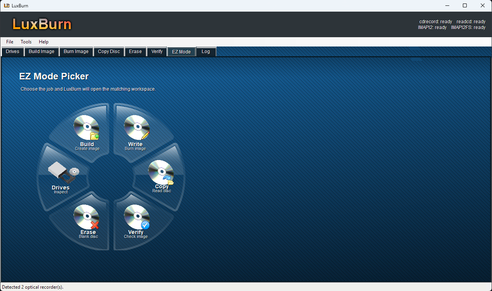

<div align="center">


# LuxBurn

[](LICENSE)
[]()

</div>

## About

LuxBurn is a Windows disc burning utility focused on practical optical media workflows. Version 2.1.0 is designed to run from Windows XP through Windows 11.

The app uses a bundled cdrecord/cdrtools backend for CD and DVD writing, with Windows Disc Image Burner available as a fallback on supported Windows versions.

<div align="center">



</div>

## Highlights

| Area | Details |
|:--|:--|
| Burn images | Writes ISO images to optical media using cdrecord. |
| Copy discs | Copies standard data discs to ISO-style images using readcd. |
| Build workspace | Adds drag-and-drop file/folder insertion, project save/load, root-or-folder placement, image information, options, labels, and advanced tabs. |
| Build and burn | Builds selected files/folders into an ISO and burns it in one operation, with temporary image cleanup when no ISO save path is chosen. |
| Drive tools | Adds ISO and Drive menus for device search, tray commands, erase/fixate actions, capabilities, family tree, and settings. |
| Media checks | Detects blank, non-empty, finalized, non-erasable, and oversized discs before writing. |
| Erase discs | Supports fast or full erase for rewritable media such as CD-RW and DVD-RW. |
| EZ Mode | Starts on a visual task picker for build, write, copy, erase, verify, and drive inspection workflows. |
| Updates | Checks the latest LuxBurn release manifest with cache-busting and opens the official release page when an update is available. |
| Progress | Shows write progress, buffer, and device buffer. |
| Abort handling | Aborts backend burns and asks before closing during an active burn. |
| Verification | Calculates SHA-256, SHA-1, SHA-512, or MD5 checksums. |
| Windows support | Built with .NET Framework 4 for Windows XP through Windows 11. |

## Launch

Download the newest build without typing anything:

| Package | Link |
|:--|:--|
| Installer | [Download LuxBurn-v2.1.0-setup.exe](https://github.com/sccpsteve/LuxBurn/releases/download/latest/LuxBurn-v2.1.0-setup.exe) |
| Portable | [Download LuxBurn-v2.1.0-portable.zip](https://github.com/sccpsteve/LuxBurn/releases/download/latest/LuxBurn-v2.1.0-portable.zip) |

The full latest build page is [Latest LuxBurn Build](https://github.com/sccpsteve/LuxBurn/releases/tag/latest).

To build packages locally without typing commands, double-click:

```cmd
Build Packages.cmd
```

Build LuxBurn:

```cmd
build-xp.cmd
```

Run LuxBurn:

```cmd
run-xp.cmd
```

Open the built executable directly:

```cmd
LuxBurn\bin\Release\LuxBurn.exe
```

## Release Artifact

Build both release packages:

```cmd
package.cmd
```

This creates:

```cmd
dist\LuxBurn-v2.1.0-portable.zip
dist\LuxBurn-v2.1.0-setup.exe
```

The portable package runs anywhere after extraction. The setup package is built with Inno Setup 5.6.1 for Windows XP compatibility, installs LuxBurn through a standard setup wizard, and creates Start Menu/Desktop shortcuts.

GitHub Actions also runs `package.cmd` on every push to `main`, so each commit produces fresh installer and portable artifacts from the current source. The latest successful `main` build is also published to the [Latest LuxBurn Build](https://github.com/sccpsteve/LuxBurn/releases/tag/latest) release, and the direct download links above always point to that latest build.

## Notes

- LuxBurn normally launches without Administrator permissions. If a drive blocks access, try running it as Administrator as a troubleshooting step.
- CD-R and other write-once media cannot be erased or safely resumed after a failed write.
- If cdrecord is unavailable, LuxBurn can open Windows Disc Image Burner on Windows versions that include it.
- Bundled third-party tools retain their own licenses. See `THIRD-PARTY-NOTICES.txt` in packaged builds.

## Credits

LuxBurn is created and maintained by Tristan | sccpsteve.com, with coordination help from OpenAI Codex.

LuxBurn began as a Windows-focused remix of SvenGDK's Open Burning Suite and keeps the original BSD 2-Clause licensing.

LuxBurn also takes practical backend and workflow inspiration from CDRTFE, especially around using cdrtools reliably from a Windows interface.

Some logo and icon artwork borrows from Mozilla Firefox Pinstripe theme artwork. Firefox logo artwork is credited to Jon Hicks / Hicksdesign, based on a Daniel Burka concept and Stephen Desroches sketch.

## License

Distributed under the BSD 2-Clause License. See [LICENSE](LICENSE).
