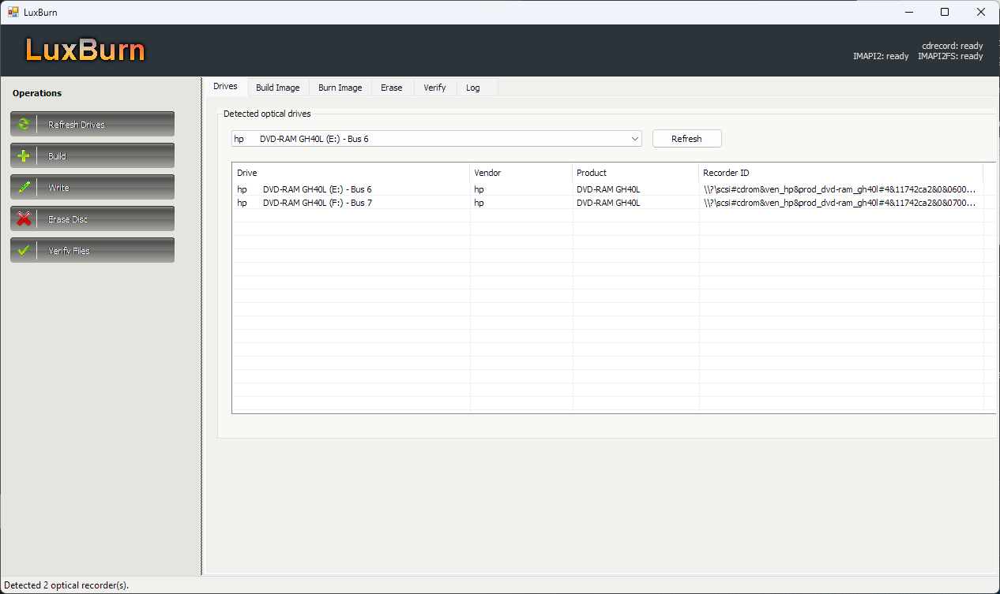

<div align="center">


# LuxBurn [Indev.]

[](LICENSE)
[]()

</div>

## About

LuxBurn is a Windows disc burning utility focused on practical optical media workflows. Version 1.4 is designed to run from Windows XP through Windows 11.

The compatibility build uses a bundled cdrecord/cdrtools backend for CD and DVD writing, with Windows Disc Image Burner available as a fallback on supported Windows versions.

<div align="center">



</div>

## Highlights

| Area | Details |
|:--|:--|
| Burn images | Writes ISO images to optical media using cdrecord. |
| Copy discs | Copies standard data discs to ISO-style images using readcd. |
| Build workspace | Adds drag-and-drop file/folder insertion, project save/load, image information, options, labels, and advanced tabs. |
| Drive tools | Adds ISO and Drive menus for device search, tray commands, erase/fixate actions, capabilities, family tree, and settings. |
| Media checks | Detects blank, non-empty, finalized, non-erasable, and oversized discs before writing. |
| Erase discs | Supports fast or full erase for rewritable media such as CD-RW and DVD-RW. |
| Wizards | Adds guided entry points for data, audio, video, game, copy, and erase workflows. |
| Progress | Shows write progress, buffer, and device buffer. |
| Abort handling | Aborts backend burns and asks before closing during an active burn. |
| Verification | Calculates SHA-256, SHA-1, SHA-512, or MD5 checksums. |
| Windows support | Built with .NET Framework 4 for Windows XP through Windows 11. |

## Launch

Build LuxBurn:

```cmd
build-xp.cmd
```

Run LuxBurn:

```cmd
run-xp.cmd
```

Open the built executable directly:

```cmd
OpenBurningSuite.Xp\bin\Release\LuxBurn.exe
```

## Release Artifact

The v1.4 release zip is created as:

```cmd
LuxBurn-v1.4.zip
```

## Notes

- LuxBurn normally launches without Administrator permissions. If a drive blocks access, try running it as Administrator as a troubleshooting step.
- CD-R and other write-once media cannot be erased or safely resumed after a failed write.
- If cdrecord is unavailable, LuxBurn can open Windows Disc Image Burner on Windows versions that include it.
- Windows XP through Windows 11 support notes are documented in [WINDOWS_XP.md](WINDOWS_XP.md).
- Bundled third-party tools retain their own licenses.

## License

Distributed under the BSD 2-Clause License. See [LICENSE](LICENSE).
